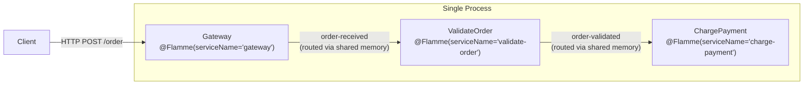
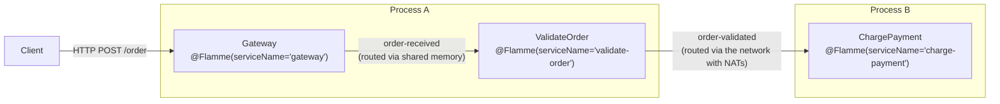

The flamme-example is an order processing pipeline where an incoming order is validated and then charged. 

When all components are in the same process, Flamme uses **a local broker** to route messages (no NATS). When split across processes, it routes messages over **NATS** automatically, no code changes required to the produced artifact.

### Setup NATS
You need to have a nats cluster available before running a Flamme application. You can follow the [official guide](https://docs.nats.io/running-a-nats-service/introduction/installation).

For this example, using docker will be more than enough: 

```bash
docker pull nats:latest
docker run -p 4222:4222 -ti nats:latest
```

The NATS server URL is configured in `flamme-example/src/main/resources/application.properties`:

```properties
nats.url="nats://localhost:4222"
```


### Run as a monolith

```bash
cd flamme-example
java -jar ./target/quarkus-app/quarkus-run.jar
```




### Run as distributed

```bash
java -jar -Dflamme.services.validate-order.remote=true \
-Dflamme.services.gateway.remote=true \
-Dquarkus.http.host-enabled=false \
./target/quarkus-app/quarkus-run.jar
```

```bash
java -jar -Dflamme.services.charge-payment.remote=true \
./target/quarkus-app/quarkus-run.jar
```




The example exposes a REST endpoint. Send an order:

```bash
curl -X POST http://localhost:8080/order \
  -H "Content-Type: application/json" \
  -d '{"id": "order-1", "amount": 100}'
```

### How it works

Each step is a Java interface annotated with `@Flamme`, declaring the NATS subjects it `consumes` and `produces`:

```java
// 1. Gateway — entry point, publishes to "order-received"
@Flamme(serviceName = "gateway", consumes = {}, produces = {"order-received"}, ...)
public interface Gateway {
    CompletableFuture<Map<String, Message>> execute(Map<String, Message> arguments);
}

// 2. ValidateOrder — consumes "order-received", publishes to "order-validated"
@Flamme(serviceName = "validate-order",
        consumes = {"order-received"}, produces = {"order-validated"}, ...)
public interface ValidateOrder {
    Map<String, Message> validateOrder(Map<String, Message> args);
}

// 3. ChargePayment — consumes "order-validated", terminal step
@Flamme(serviceName = "charge-payment",
        consumes = {"order-validated"}, produces = {}, ...)
public interface ChargePayment {
    Map<String, Message> chargePayment(Map<String, Message> args);
}
```

